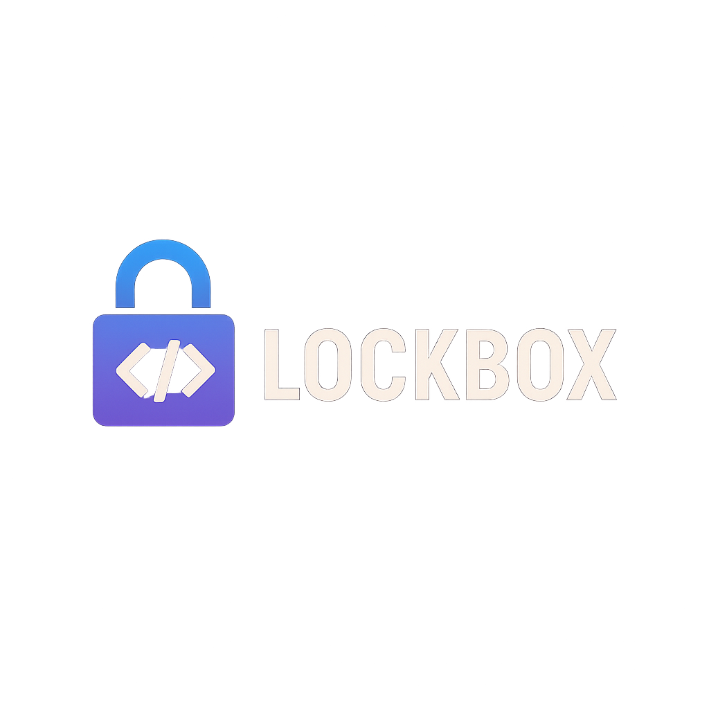

[](https://github.com/n3xt0r/filament-lockbox/actions/workflows/run-tests.yml)
[](https://qlty.sh/gh/N3XT0R/projects/filament-lockbox)
[](https://qlty.sh/gh/N3XT0R/projects/filament-lockbox)
[](https://packagist.org/packages/n3xt0r/filament-lockbox)
[](https://packagist.org/packages/n3xt0r/filament-lockbox)

# Filament Lockbox



**Secure per-user field encryption for Filament v4.**  
This package allows you to encrypt and decrypt sensitive data on a per-user basis, using a split-key approach:

- **Part A** (server-side key) is stored encrypted in the database.
- **Part B** (user-provided secret) is collected at runtime (crypto password, passkey, or TOTP).
- **Final key** is derived from PartA + PartB using `hash('sha256', ...)`.

This ensures that **even administrators cannot decrypt data** without the user-provided input.

---

## 🚧 Project Status

This package is currently in **alpha** and under active development. Features and APIs may change before a stable
release.

---

## ✨ Features

- 🔑 **Per-user encryption keys** (split key: server + user)
- 🧩 **Plug-and-play Filament components**:
    - `EncryptedTextInput` → encrypts before save
    - `DecryptedTextDisplay` → decrypts on display
    - `UnlockLockboxAction` → prompts for crypto password or TOTP
- 🔒 **User-configurable crypto password support**
- 🗝️ **Passkey (WebAuthn) support** if your user implements `HasPasskeys`
- 🔐 **TOTP support** if your user implements `HasAppAuthentication`
- 🛡️ **Zero-knowledge for admins** – data is unreadable without user input
- ⚙️ **Configurable key material providers** (PBKDF2, Passkeys, TOTP, custom)

---

## 🗄️ Centralized Lockbox Storage

Unlike typical field encryption solutions, **Filament Lockbox does not store encrypted data on your models**.  
Instead, all encrypted values are kept in a dedicated, polymorphic `lockbox` table — completely transparent to your
application.

### ✅ Benefits of This Architecture

- **Drop-in Usage**  
  Simply use `EncryptedTextInput` anywhere in your Filament form schema — no schema changes or model attributes
  required.

- **Polymorphic & Universal**  
  Works with any Eloquent model (`User`, `Product`, `Order`, ...).  
  All sensitive data is centralized, making it easy to see which records have encrypted fields.

- **Performance-Friendly**  
  Main tables remain lean and fast, as encrypted data is kept out of your core business tables.

- **Compliance & Auditing**
    - Simplified GDPR / “Right to be Forgotten”: just delete Lockbox entries per user.
    - Perfect for audits: one table gives full visibility of all encrypted fields.
    - Allows separate backup and retention strategies.

- **Developer Experience**
    - No manual hooks or closures needed — saving & loading is handled automatically.
    - `dehydrated(false)` is applied internally.
    - Just replace `TextInput` with `EncryptedTextInput` and get full encryption.

```php
$form->schema([
    // Before:
    TextInput::make('credit_card'),

    // After:
    EncryptedTextInput::make('credit_card')
        ->label('Credit Card'),
]);
```

The plugin takes care of everything:

- 🔑 Per-user key management
- 🔐 Encryption & decryption
- 🗄️ Transparent Lockbox record handling
- 🔄 Auto-loading of values on form display
- 🧹 Automatic cleanup when models are deleted

---

## 🔑 How It Works (Key Derivation)

```
           ┌────────────────────────┐
           │  encrypted_user_key    │  (in DB, encrypted with APP_KEY)
           └──────────┬─────────────┘
                      │ decrypt
                      ▼
                 ┌──────────┐
                 │  Part A  │  (server key)
                 └─────┬────┘
                       │
                       │
           ┌───────────▼───────────┐
           │  Part B (User Input) │  ← crypto password, passkey, or TOTP
           └───────────┬──────────┘
                       │ combine
                       ▼
              ┌───────────────────┐
              │  Final Key (32B)  │
              └─────────┬─────────┘
                        │
          ┌─────────────▼─────────────┐
          │ Encrypt / Decrypt fields │
          └──────────────────────────┘
```

This means **database leaks alone cannot decrypt your data** – PartB must be provided by the user.

---

## 🚀 Installation

Install the package via Composer:

```bash
composer require n3xt0r/filament-lockbox
```

> **Important:**  
> This package integrates with [`spatie/laravel-passkeys`](https://github.com/spatie/laravel-passkeys).
> Before running the install command, make sure you have published and run the Spatie migrations:

```bash
php artisan vendor:publish --provider="Spatie\\LaravelPasskeys\\LaravelPasskeysServiceProvider" --tag="laravel-passkeys-migrations"
php artisan migrate
Run the install command to publish all required assets and migrations:

```bash
php artisan filament-lockbox:install
```

---

## 🔌 Register the Plugin (Filament v4)

Add the plugin to your Filament panel provider:

```php
// app/Providers/Filament/AdminPanelProvider.php

use Filament\Panel;
use Filament\PanelProvider;
use N3XT0R\FilamentLockbox\FilamentLockboxPlugin;

class AdminPanelProvider extends PanelProvider
{
    public function panel(Panel $panel): Panel
    {
        return $panel
            ->plugins([
                FilamentLockboxPlugin::make(),
            ]);
    }
}
```

Optional configuration:

```php
// config/filament-lockbox.php
return [
    'show_widget' => true, // set false to hide the status widget
    'providers' => [
        \N3XT0R\FilamentLockbox\Managers\KeyMaterial\TotpKeyMaterialProvider::class,
        \N3XT0R\FilamentLockbox\Managers\KeyMaterial\CryptoPasswordKeyMaterialProvider::class,
    ],
];
```

You can publish the config and translations if you need customization:

```bash
php artisan vendor:publish --tag="filament-lockbox-config"
php artisan vendor:publish --tag="filament-lockbox-translations"
```

---

## ⚙️ Model Setup

Your `User` model must:

- Implement `HasLockboxKeys`
- Use the `InteractsWithLockboxKeys` trait
- Hide and cast the lockbox fields

### Example: User Model

```php
use Filament\Models\Contracts\FilamentUser;
use Illuminate\Contracts\Auth\MustVerifyEmail;
use Illuminate\Foundation\Auth\User as Authenticatable;
use N3XT0R\FilamentLockbox\Contracts\HasLockboxKeys;
use N3XT0R\FilamentLockbox\Concerns\InteractsWithLockboxKeys;

class User extends Authenticatable implements FilamentUser, MustVerifyEmail, HasLockboxKeys
{
    use InteractsWithLockboxKeys;

    protected $hidden = [
        'encrypted_user_key',
        'crypto_password_hash',
        'lockbox_provider',
    ];

    protected function casts(): array
    {
        return [
            'encrypted_user_key' => 'encrypted',
            'crypto_password_hash' => 'string',
            'lockbox_provider' => 'string',
        ];
    }
}
```

### Example: Any Model with Encrypted Fields

Any Eloquent model that should have encrypted fields must:

- Implement `HasLockbox`
- Use the `InteractsWithLockbox` trait

This enables the polymorphic relation to the `lockbox` table and lets the package handle encryption transparently.

```php
use Illuminate\Database\Eloquent\Model;
use N3XT0R\FilamentLockbox\Contracts\HasLockbox;
use N3XT0R\FilamentLockbox\Concerns\InteractsWithLockbox;

class Company extends Model implements HasLockbox
{
    use InteractsWithLockbox;

    protected $fillable = [
        'name',
        'email',
        // no need to list encrypted fields here – they live in the lockbox table
    ];
}
```

You can now use `EncryptedTextInput::make('field_name')` in your Filament form schemas for this model —  
the package will automatically store and retrieve the data from the centralized `lockbox` table.

---

## 🧑‍💻 User Flow

1. Go to the **Lockbox widget** in your Filament panel.
2. Click **Generate Lockbox Key**.
3. Set a **crypto password**, register a **passkey**, or enable **TOTP**.
4. Unlock once per session to access or modify encrypted fields.

---

## 🧩 Usage in Filament Forms

### 1️⃣ Storing Encrypted Data

```php
use N3XT0R\FilamentLockbox\Forms\Actions\UnlockLockboxAction;
use N3XT0R\FilamentLockbox\Forms\Components\EncryptedTextInput;

$form
    ->schema([
        EncryptedTextInput::make('secret_notes')
            ->label('Secret Notes'),
    ])
    ->extraActions([
        UnlockLockboxAction::make(),
    ]);
```

### 2️⃣ Displaying Decrypted Data

```php
use N3XT0R\FilamentLockbox\Forms\Components\DecryptedTextDisplay;
use N3XT0R\FilamentLockbox\Forms\Actions\UnlockLockboxAction;

$form
    ->schema([
        DecryptedTextDisplay::make('secret_notes')
            ->label('Secret Notes'),
    ])
    ->extraActions([
        UnlockLockboxAction::make(),
    ]);
```

--- 

## 🤝 Sharing & Collaboration

Filament Lockbox provides a mechanism to **share encrypted secrets** with other users or groups.

### 1️⃣ Sharing a Lockbox Entry

You can trigger sharing via the provided `ShareLockboxAction`.  
This will allow you to select a recipient user or group and create a **grant** for them.

```php
use N3XT0R\FilamentLockbox\Forms\Actions\ShareLockboxAction;

ShareLockboxAction::make()
    ->visible(fn ($record) => auth()->id() === $record->user_id), // only owner can share
```

This opens a modal with:

- **Share type** (User / Group)
- **Recipient selection** (searchable dropdown)

After confirmation, the **Data Encryption Key (DEK)** for the selected lockbox item is securely wrapped for the chosen
recipient.

---

### 2️⃣ Displaying Shared Values

For users who received access via a grant, you can display the value using:

```php
use N3XT0R\FilamentLockbox\Forms\Components\SharedDecryptedTextDisplay;

SharedDecryptedTextDisplay::make('secret_notes')
    ->label('Shared Secret')
```

The component:

- Decrypts the value using the grant's DEK.
- Displays a subtle **"shared with you"** indicator below the value.
- Falls back to a placeholder if the user has no access.

---

### 3️⃣ Read-Only Access in Forms

If you want shared users to see the encrypted value inside a form without being able to overwrite it, use:

```php
use N3XT0R\FilamentLockbox\Forms\Components\SharedEncryptedTextInput;

SharedEncryptedTextInput::make('secret_notes')
    ->label('Shared Secret (read-only)')
```

This behaves like `EncryptedTextInput` but is **disabled** and does not persist new values on save.

---

### ✅ Benefits of Sharing

- **Least-privilege access:** Grants are per-lockbox entry, not global.
- **Support for groups:** Share once, all group members get access.
- **Revocable:** Remove a grant to immediately revoke access.
- **Audit-friendly:** Grants are stored in a separate `lockbox_grants` table.

---

## 🔒 Security Model

- Split-key encryption (PartA + PartB → Final Key)
- PBKDF2 key derivation with 100,000 iterations
- Server keys stored encrypted with `APP_KEY`
- Extensible providers for alternative key material

---

### 🔑 Passkeys (WebAuthn)

This package ships with built-in support for [spatie/laravel-passkeys](https://github.com/spatie/laravel-passkeys) and
requires it by default.

You can control Passkey usage via this package's configuration.
If you don't plan to use WebAuthn/Passkeys, disable the integration in `config/filament-lockbox.php`.


---

## 📖 Roadmap

- [ ] Textarea and file encryption support
- [ ] Automatic modal prompt if unlock is missing
- [ ] Session-based unlock expiry
- [ ] Configurable PBKDF2 parameters

---

## 📜 License

MIT © [N3XT0R](https://github.com/N3XT0R)
