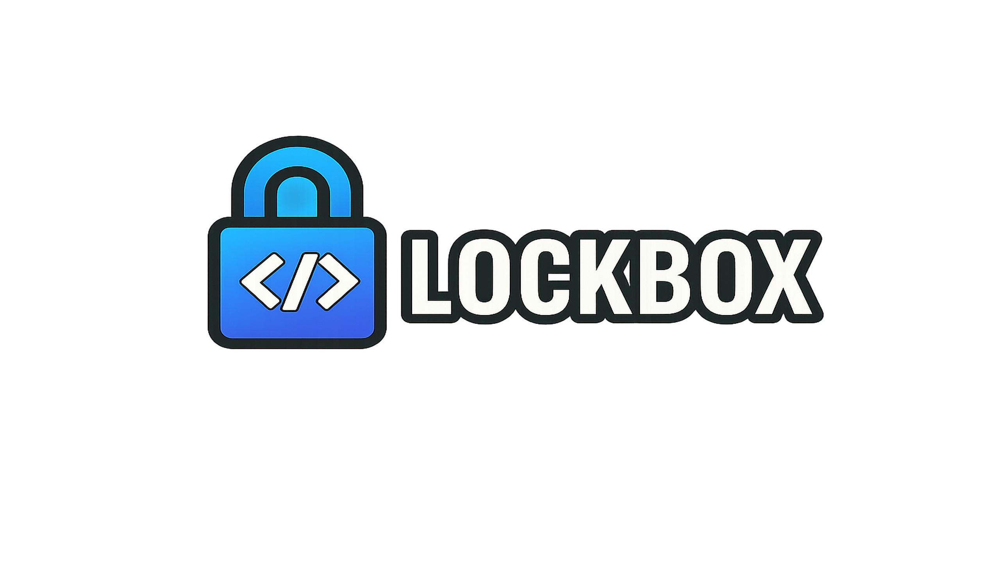

[](https://github.com/n3xt0r/filament-lockbox/actions/workflows/run-tests.yml)
[](https://qlty.sh/gh/N3XT0R/projects/filament-lockbox)
[](https://qlty.sh/gh/N3XT0R/projects/filament-lockbox)
[](https://packagist.org/packages/n3xt0r/filament-lockbox)
[](https://packagist.org/packages/n3xt0r/filament-lockbox)

# Filament Lockbox



**Secure per-user field encryption for Filament v4.**  
This package allows you to encrypt and decrypt sensitive data on a per-user basis, using a split-key approach:

- **Part A** (server-side key) is stored encrypted in the database.
- **Part B** (user-provided secret) is collected at runtime (crypto password or TOTP).
- **Final key** is derived from PartA + PartB using `hash('sha256', ...)`.

This ensures that **even administrators cannot decrypt data** without the user-provided input.

---

## ✨ Features

- 🔑 **Per-user encryption keys** (split key: server + user)
- 🧩 **Plug-and-play Filament components**:
    - `EncryptedTextInput` → encrypts before save
    - `DecryptedTextDisplay` → decrypts on display
    - `UnlockLockboxAction` → prompts for crypto password/TOTP
- 🔒 **User-configurable crypto password support**
- 🔐 **TOTP support** if your user implements `HasAppAuthentication`
- 🛡️ **Zero-knowledge for admins** – data is unreadable without user input
- ⚙️ **Configurable key material providers** (PBKDF2, TOTP, custom)

---

## 🔑 How It Works (Key Derivation)

```
           ┌────────────────────────┐
           │  encrypted_user_key    │  (in DB, encrypted with APP_KEY)
           └──────────┬─────────────┘
                      │ decrypt
                      ▼
                 ┌──────────┐
                 │  Part A  │  (server key)
                 └─────┬────┘
                       │
                       │
           ┌───────────▼───────────┐
           │  Part B (User Input) │  ← crypto password or TOTP
           └───────────┬──────────┘
                       │ combine
                       ▼
              ┌───────────────────┐
              │  Final Key (32B)  │
              └─────────┬─────────┘
                        │
          ┌─────────────▼─────────────┐
          │ Encrypt / Decrypt fields │
          └──────────────────────────┘
```

This means **database leaks alone cannot decrypt your data** – PartB must be provided by the user.

---

## 🚀 Installation

```bash
composer require n3xt0r/filament-lockbox
php artisan migrate
```

---

## 🔌 Register the Plugin (Filament v4)

Add the plugin to your Filament panel provider:

```php
// app/Providers/Filament/AdminPanelProvider.php

use Filament\Panel;
use Filament\PanelProvider;
use N3XT0R\FilamentLockbox\FilamentLockboxPlugin;

class AdminPanelProvider extends PanelProvider
{
    public function panel(Panel $panel): Panel
    {
        return $panel
            ->plugins([
                FilamentLockboxPlugin::make(),
            ]);
    }
}
```

Optional configuration:

```php
// config/filament-lockbox.php
return [
    'show_widget' => true, // set false to hide the status widget
    'providers' => [
        \N3XT0R\FilamentLockbox\Support\KeyMaterial\TotpKeyMaterialProvider::class,
        \N3XT0R\FilamentLockbox\Support\KeyMaterial\CryptoPasswordKeyMaterialProvider::class,
    ],
];
```

You can publish the config and translations if you need customization:

```bash
php artisan vendor:publish --tag="filament-lockbox-config"
php artisan vendor:publish --tag="filament-lockbox-translations"
```

---

## ⚙️ Model Setup

Your `User` model must:

- Implement `HasLockboxKeys`
- Use the `InteractsWithLockboxKeys` trait
- Hide and cast the lockbox fields

### Example

```php
use Filament\Models\Contracts\FilamentUser;
use Illuminate\Contracts\Auth\MustVerifyEmail;
use Illuminate\Foundation\Auth\User as Authenticatable;
use N3XT0R\FilamentLockbox\Contracts\HasLockboxKeys;
use N3XT0R\FilamentLockbox\Concerns\InteractsWithLockboxKeys;

class User extends Authenticatable implements FilamentUser, MustVerifyEmail, HasLockboxKeys
{
    use InteractsWithLockboxKeys;

    protected $hidden = [
        'encrypted_user_key',
        'crypto_password_hash',
    ];

    protected function casts(): array
    {
        return [
            'encrypted_user_key' => 'encrypted',
            'crypto_password_hash' => 'string',
        ];
    }
}
```

---

## 🧑‍💻 User Flow

1. Go to the **Lockbox widget** in your Filament panel.
2. Click **Generate Lockbox Key**.
3. Set a **crypto password** (or enable TOTP).
4. Unlock once per session to access or modify encrypted fields.

---

## 🧩 Usage in Filament Forms

### 1️⃣ Storing Encrypted Data

```php
use N3XT0R\FilamentLockbox\Forms\Actions\UnlockLockboxAction;
use N3XT0R\FilamentLockbox\Forms\Components\EncryptedTextInput;

$form
    ->schema([
        EncryptedTextInput::make('secret_notes')
            ->label('Secret Notes'),
    ])
    ->extraActions([
        UnlockLockboxAction::make(),
    ]);
```

### 2️⃣ Displaying Decrypted Data

```php
use N3XT0R\FilamentLockbox\Forms\Components\DecryptedTextDisplay;
use N3XT0R\FilamentLockbox\Forms\Actions\UnlockLockboxAction;

$form
    ->schema([
        DecryptedTextDisplay::make('secret_notes')
            ->label('Secret Notes'),
    ])
    ->extraActions([
        UnlockLockboxAction::make(),
    ]);
```

---

## 🔒 Security Model

- Split-key encryption (PartA + PartB → Final Key)
- PBKDF2 key derivation with 100,000 iterations
- Server keys stored encrypted with `APP_KEY`
- Extensible providers for alternative key material

---

### 🔑 Optional Integration: Passkeys

This package ships with built-in support for [spatie/laravel-passkeys](https://github.com/spatie/laravel-passkeys) and
installs it by default.

Whether Passkeys are used or not can be controlled via this package's configuration.
If you don't plan to use WebAuthn/Passkeys, you can disable the integration in `config/filament-lockbox.php`.


---

## 📖 Roadmap

- [ ] Textarea and file encryption support
- [ ] Automatic modal prompt if unlock is missing
- [ ] Session-based unlock expiry
- [ ] Configurable PBKDF2 parameters

---

## 📜 License

MIT © [N3XT0R](https://github.com/N3XT0R)
